# Lab 3: Improve Order Fulfillment and Customer Satisfaction using Suggest Substitute Items and Summarize Records with Copilot

**Introduction**

In this lab, you will learn how Copilot in Dynamics 365 Business Central helps improve order fulfillment and customer satisfaction by recommending suitable substitute items and providing intelligent summaries of purchasing records. 

The lab is divided into two exercises, the first focuses on using Copilot to suggest and manage substitute items with confidence-based recommendations, while the second demonstrates how Copilot summarizes purchase orders to support faster review and better decision-making. 

Together, these exercises highlight how Copilot enhances efficiency and accuracy across inventory and purchasing processes.

## Exercise 1: Suggest and Manage Substitute Items Using Copilot

### Task 1: Navigate to Items in Business Central

1. Navigate to <https://www.microsoft.com/en-us/dynamics-365/products/business-central/sign-in> business central and sign in with the admin tenant.

   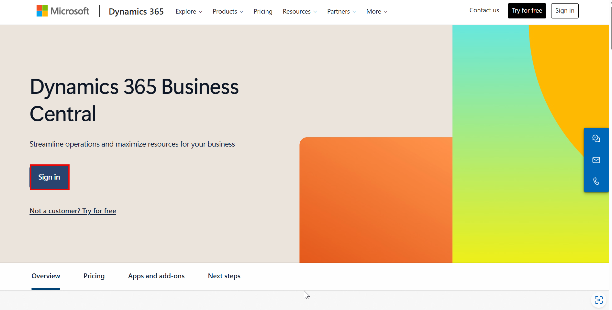

1. Dynamic 365 Buisness Central home page will open

   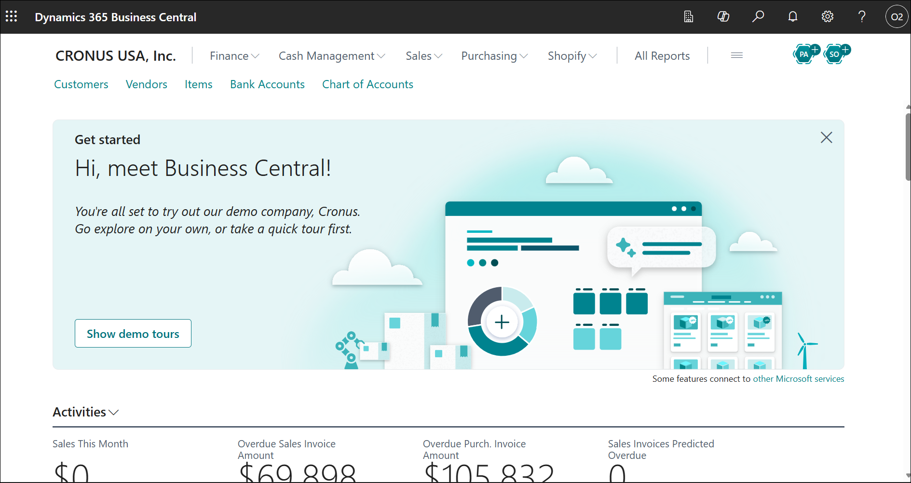

### Task 2: Refine and remove Items for Substitution using Copilot

1. In the search field, type **Items (1)** and from the search results, select **Items (2)**.

   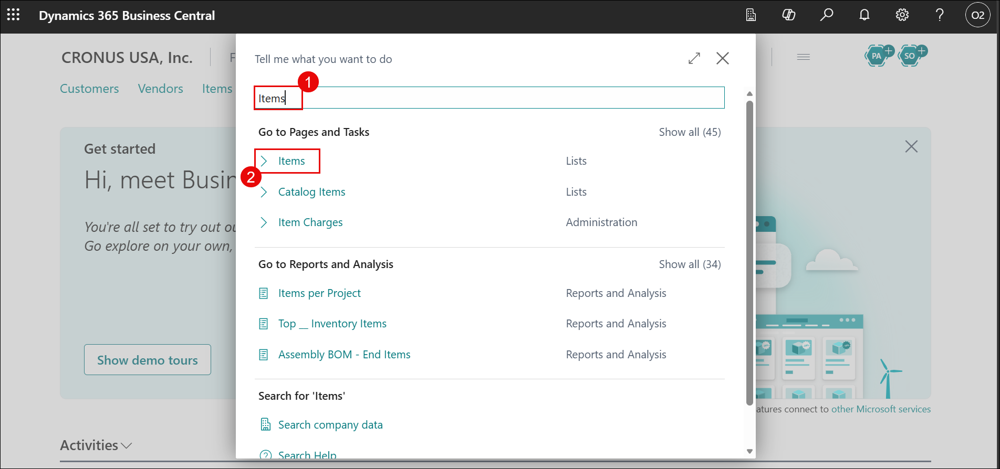

1. In the **Items** list, select **PARIS General chair, Black** to open the item card.

   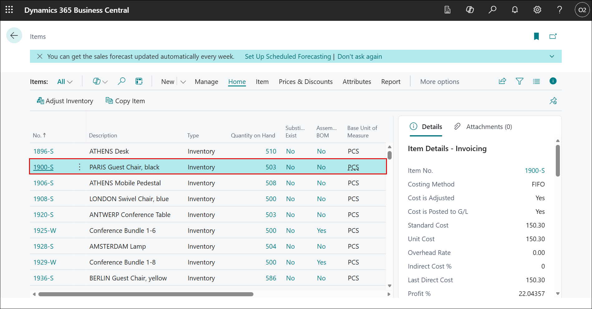

1. From the top menu, click **Item (1)** and select **Substitutions (2)** to manage alternative items for the selected product.

   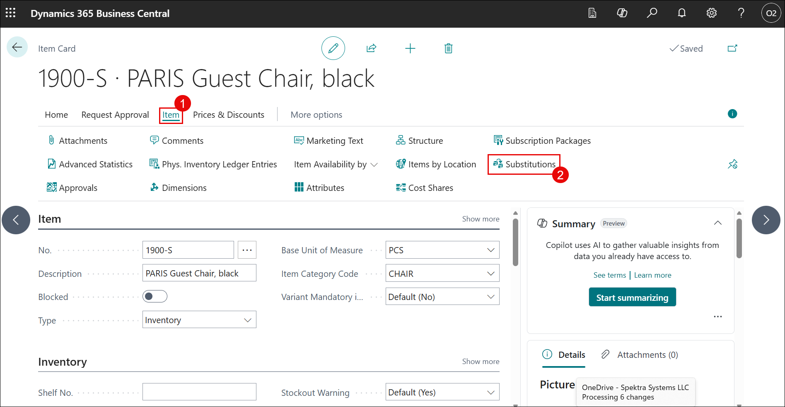

1. On the **Item Substitutions** page, click **Suggest with Copilot** to automatically generate a list of related substitute items.

   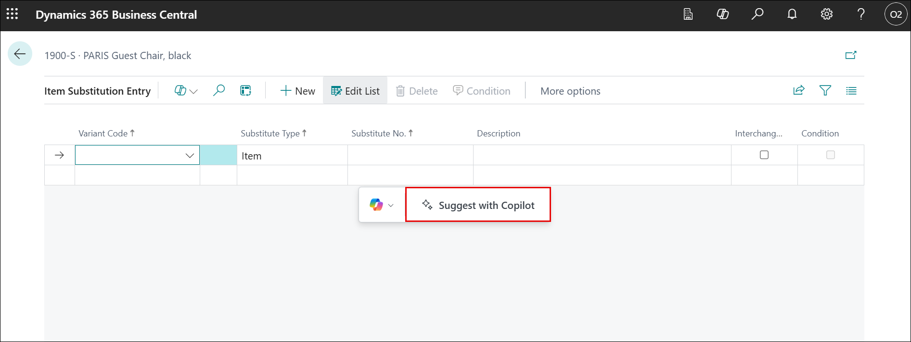

1. Review the items suggested by Copilot that are relevant to **PARIS General chair, Black**.

   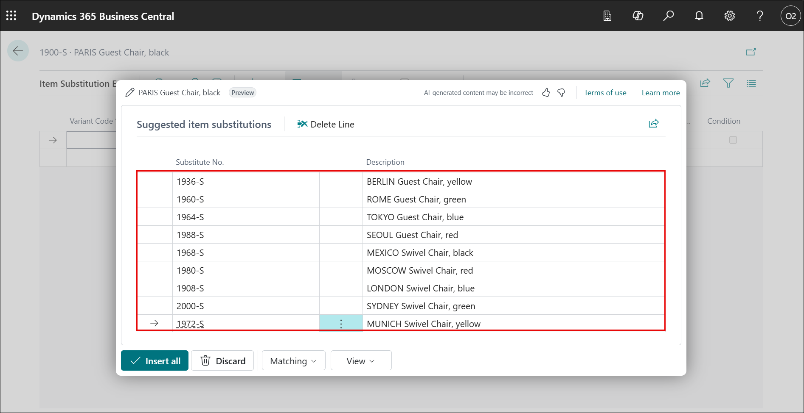

1. Click **Matching (1)**, select **Permissive (2)**, and then click **Generate (3)** to broaden the list of suggested substitute items.

   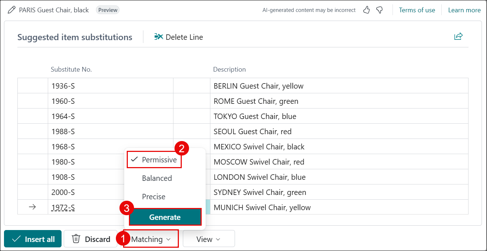

1. Click **View (1)**, select **Lines and Confidence (2)**, and click **Generate (3)** to display confidence scores for each suggested item.

   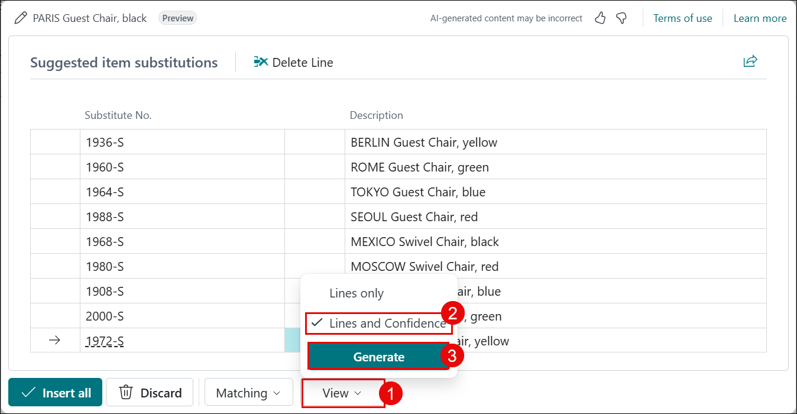

1. Identify items marked with **Low confidence**.

   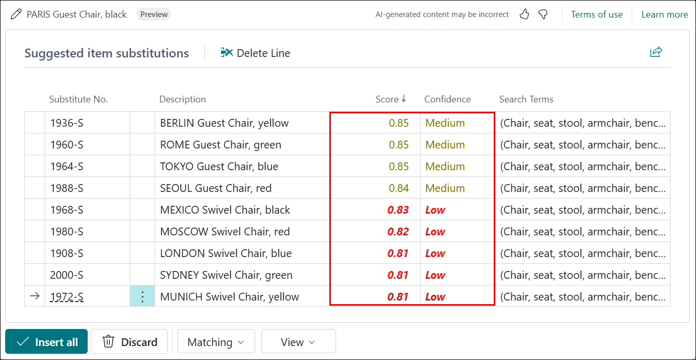

1. Use the **vertical ellipsis (⋮) (1)** and select **Select more (2)** to enable multiple selection.

   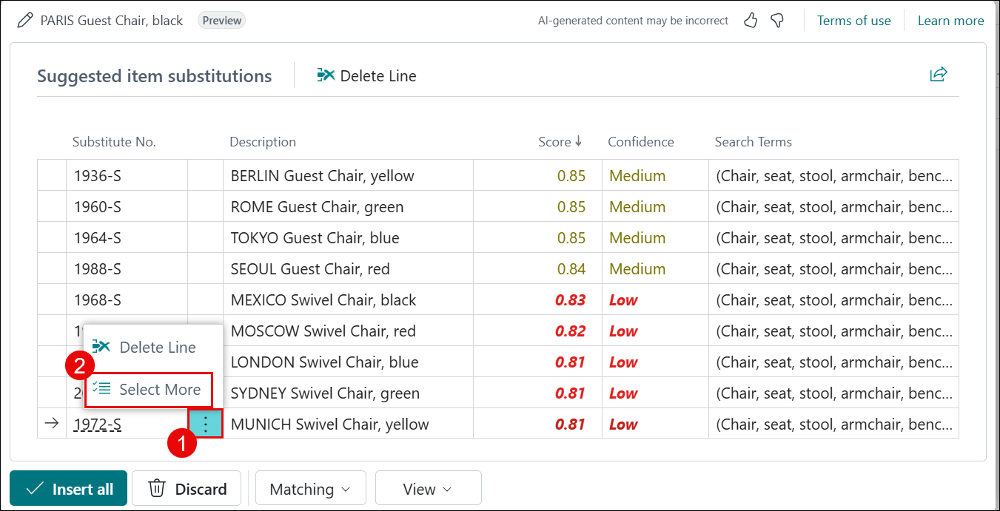

1. Select all **low-confidence (1)** items and click **Delete (2)**.

   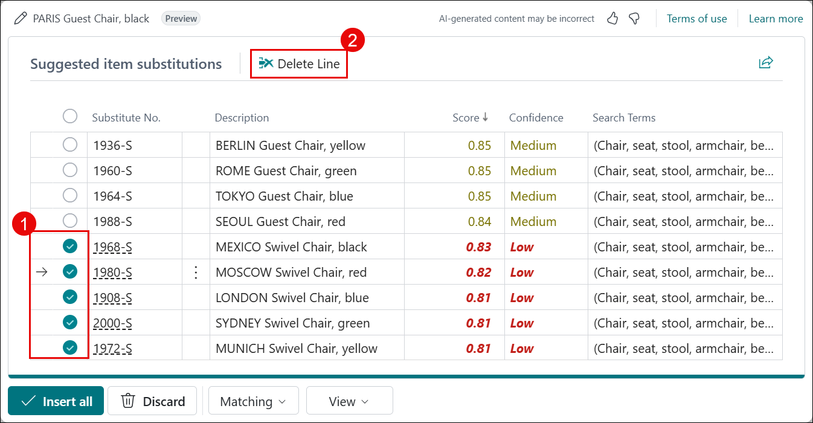

1. Click **Yes** to confirm the deletion.

   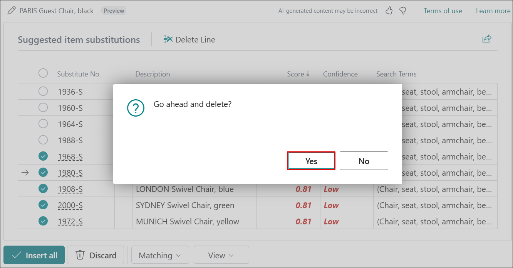

1. Click **Insert all** to add all **Medium** and **High confidence** substitute items.

   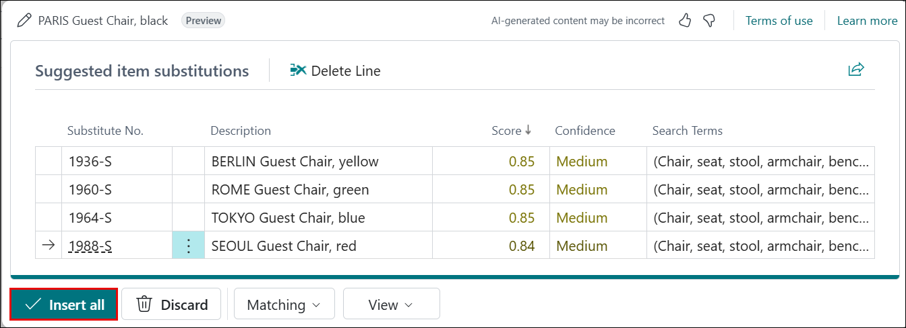

1. Verify that the substitute items are added successfully for the selected item.

   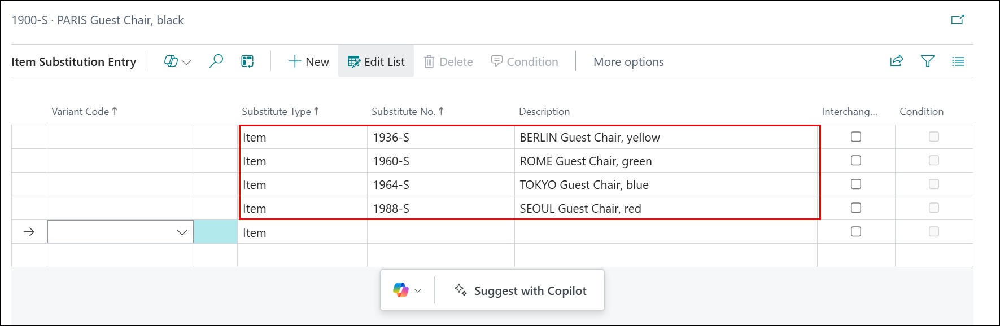

## Exercise 2: Summarize Purchase Orders Using Copilot

### Task 1: Open a Purchase Order and View Purchase Order Summary with Copilot

1. Navigate to the **Business Central Home** page.

   

1. Click **Purchasing (1)** from the top menu and select **Purchase Orders (2)**.

   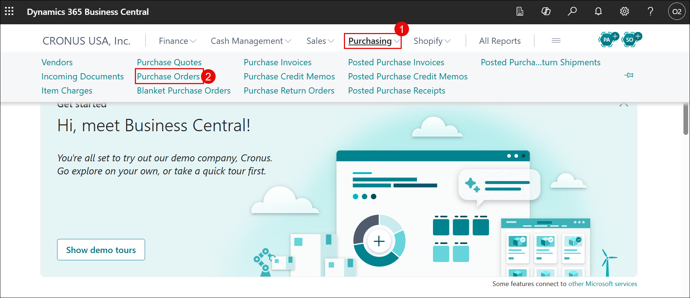

1. Open **Purchase Order No. 10601** to review its details.

   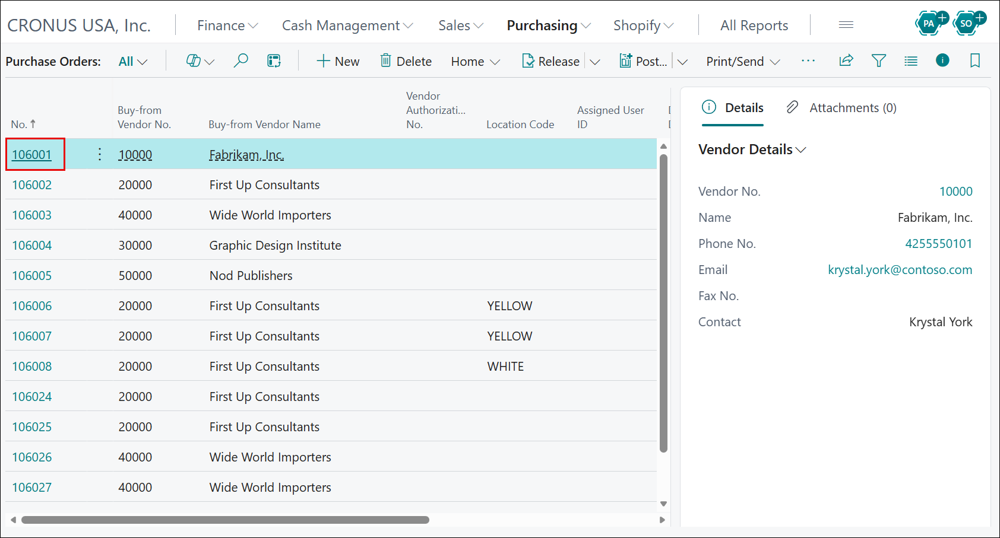

1. On the right side of the purchase order page, locate the **Summary** section , click the **down arrow** and click ** Start Summarization** to generate the summary.

   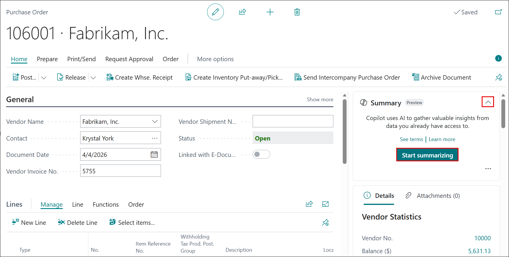

1. Click **Show more** to view additional details.

   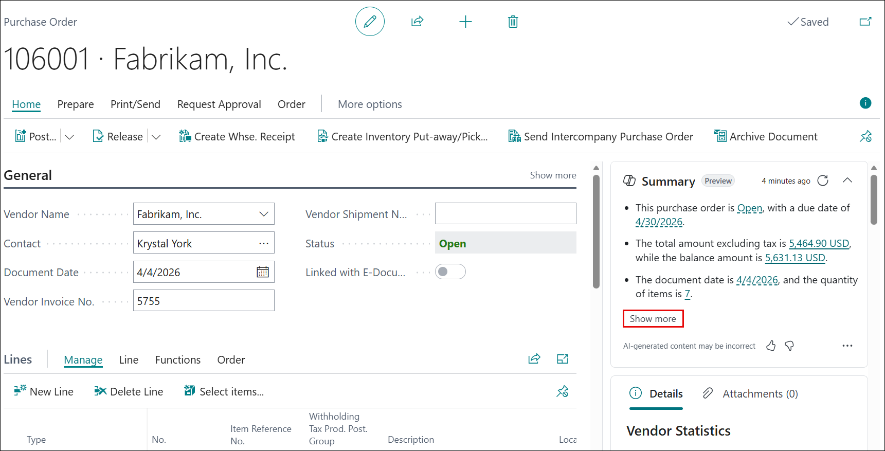

1. Review the detailed purchase order information displayed in the Copilot panel.

   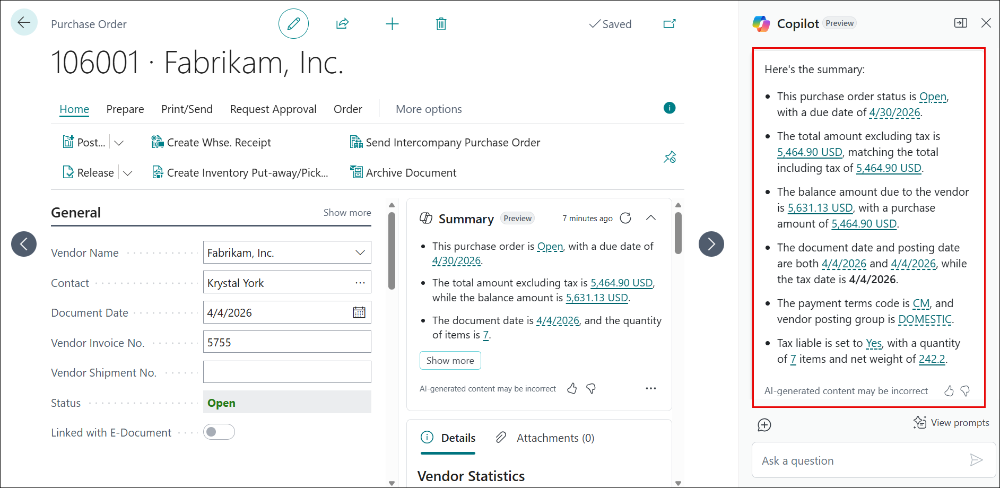

1. In the Copilot summary section, click the **horizontal ellipsis (⋯)** to view additional options.

1. Review the available actions, including hiding the summary, copying the summary, viewing related items, and learning more about the summarized content.

   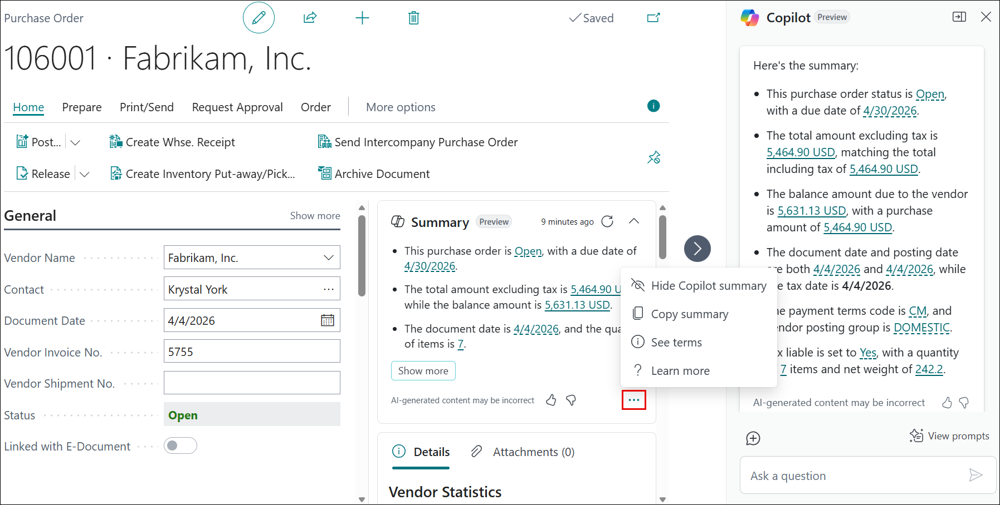

## Conclusion

By completing this lab, you have learned how to use Copilot to suggest and manage substitute items effectively, ensuring better product availability and improved order fulfillment, you also explored how Copilot summarizes purchase orders, enabling faster review and clearer insights into purchasing data. 

Together, these capabilities demonstrate how Copilot in Dynamics 365 Business Central helps teams enhance operational efficiency and deliver a better customer experience.
