# Lab 6 - Creating and Enhancing Item Marketing Text with Copilot in Business Central​

## Lab Objective

In this lab, you will learn how to use Copilot in Microsoft Dynamics 365 Business Central to generate, review, and refine marketing text for an
existing item. You will start by opening an item card, generate an AI-powered first draft using Copilot, customize the content by selecting relevant attributes, and then review, edit, and save the final version.

This lab demonstrates how AI can accelerate content creation while still requiring human  validation to ensure quality, accuracy, and brand
alignment.

## Exercise 1: Generate the First Draft with Copilot

In this exercise, you will open an existing item and use Copilot to generate a marketing text draft. You will explore two different methods
to initiate draft generation and learn how to select relevant product attributes to improve the quality of the AI-generated content.

1. In Business Central homw page , press **Alt + Q**. In the search field, type **Items**. From the search results, select **Items** to open the list of available items.

   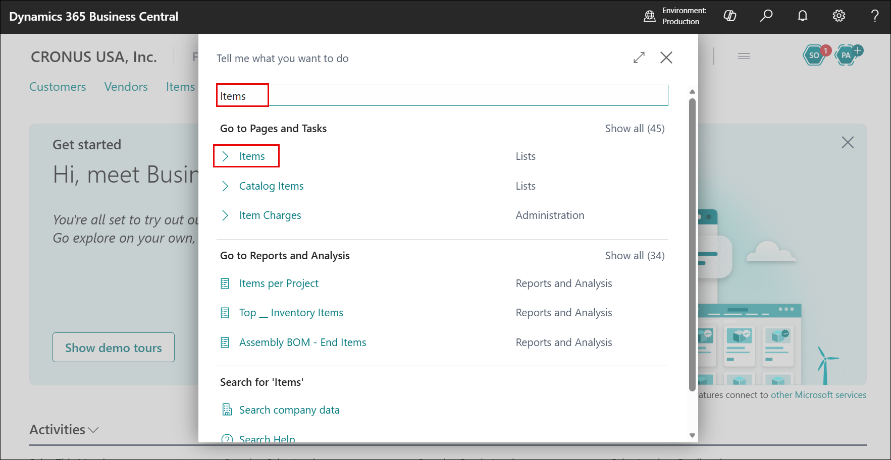

1. Locate the item **ATHENS Disk** . Select the value in the No. column to open the Item Card. You are now ready to generate marketing text for this item.

   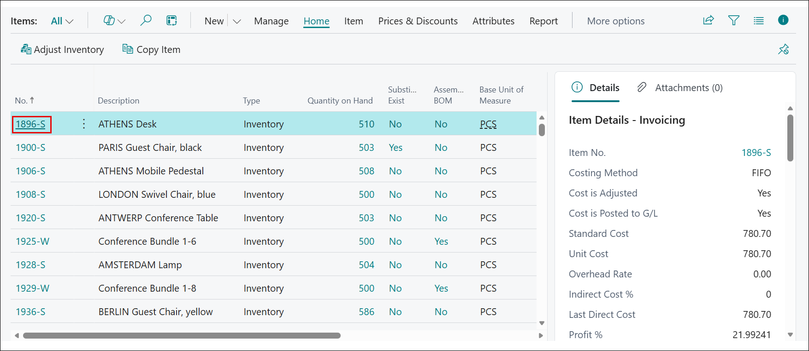

1. **Method 1: Using the Marketing Text FactBox**

   - Locate the Marketing Text pane in the FactBox area on the right side of the Item Card.

   - Select Draft with Copilot.

     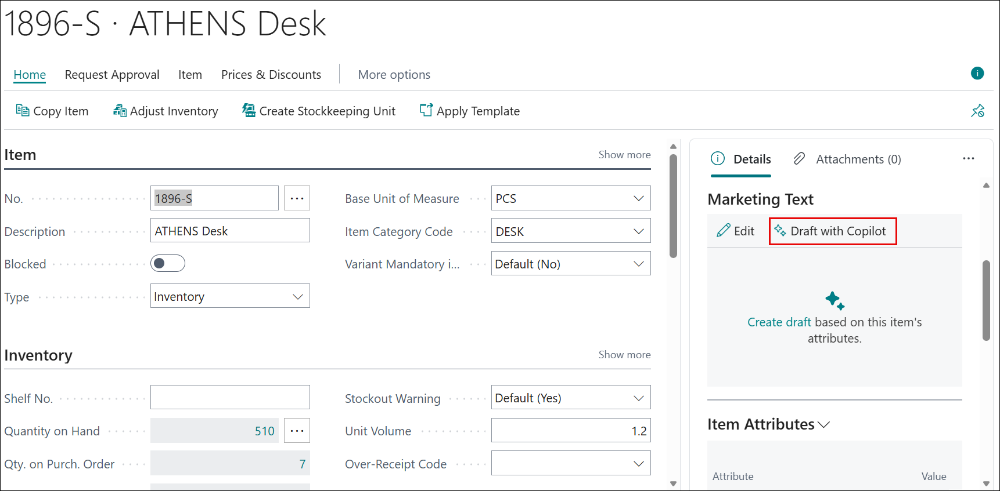

   - Copilot begins preparing a draft based on the item’s existing information.

   - Select Cancel to **close** the window and keet it to keep the generated draft

     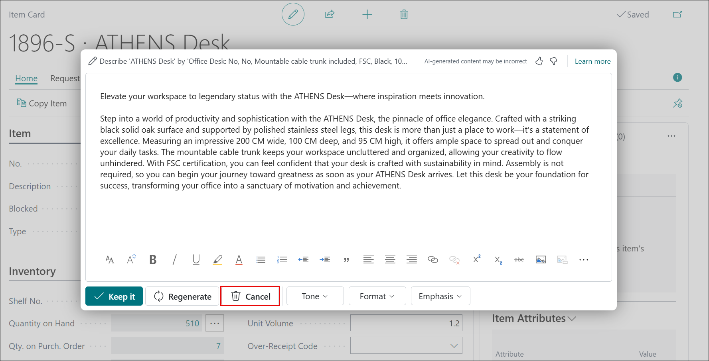

1. **Method 2: Using the Marketing Text Action**

   - At the top of the **Item (1)** Card page, select the **Marketing Text (2)** action.

     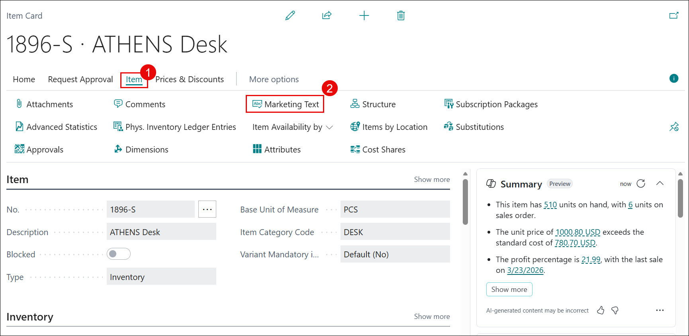

   - In the Edit Marketing Text window, select **Suggest marketing text** .

     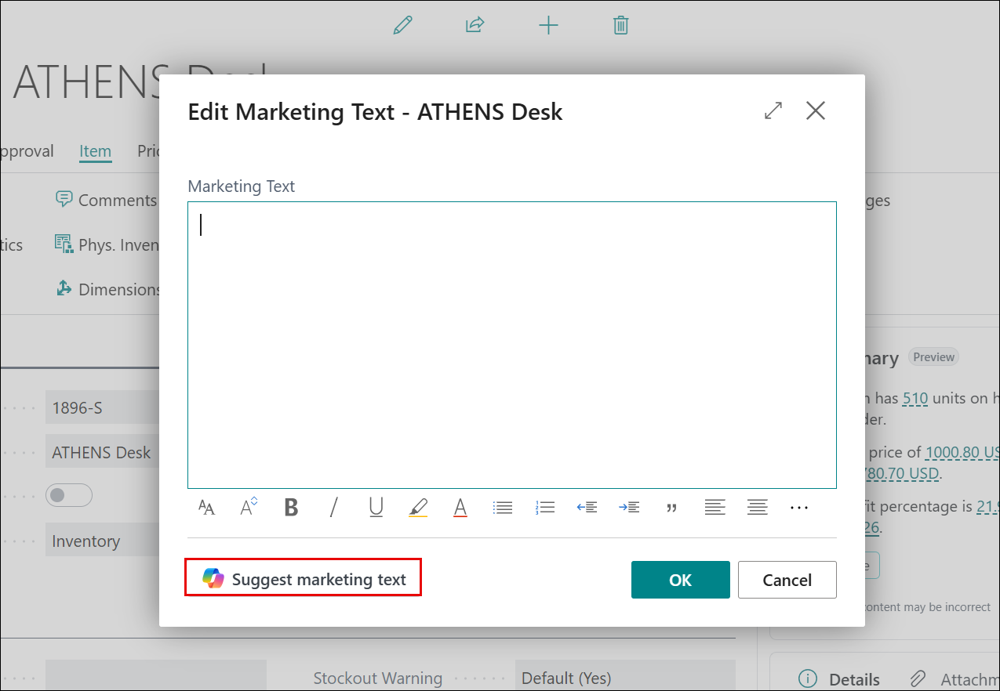

   - The Suggest marketing text window opens and displays available item attributes.

     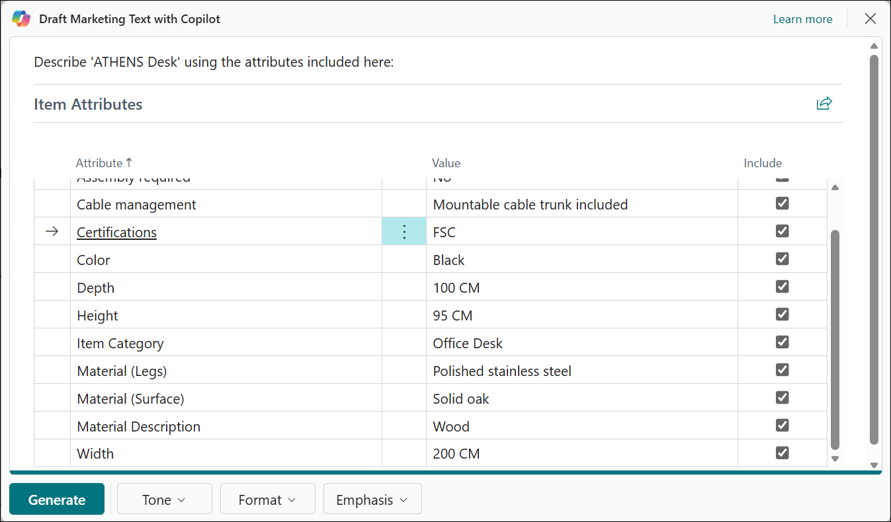

   - In the Draft Marketing Text window, review the list of available item attributes.

   - Select the vertical ellipsis (⋮) next to an item attribute. Choose Select more.

     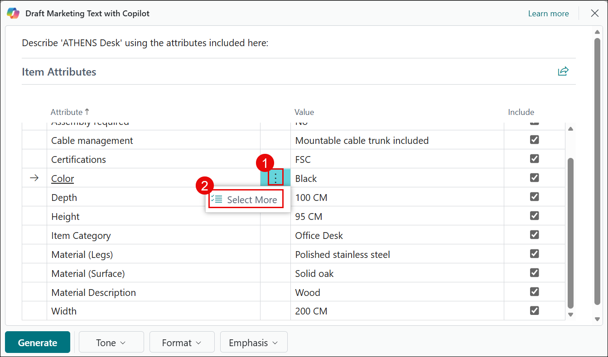

   - Select multiple attributes such as:

     - Color

     - Height

     - Material (legs)

     - Material (Surface)

   - After selecting the relevant attributes, choose Generate.

     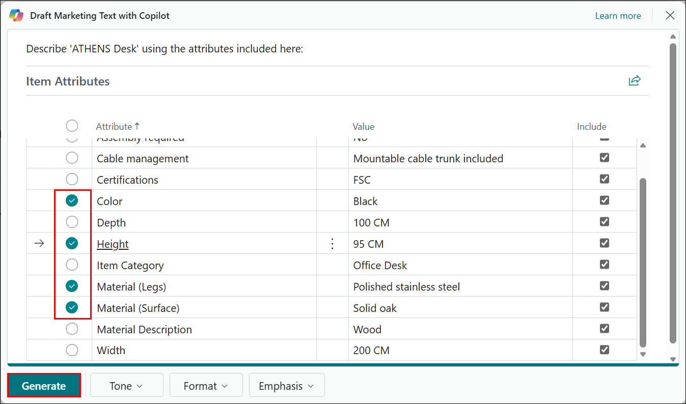

   - The generated text appears in the Copilot editor window.

   - Carefully read the draft to evaluate:

     - Clarity

     - Accuracy

     - Tone

     - Completeness

     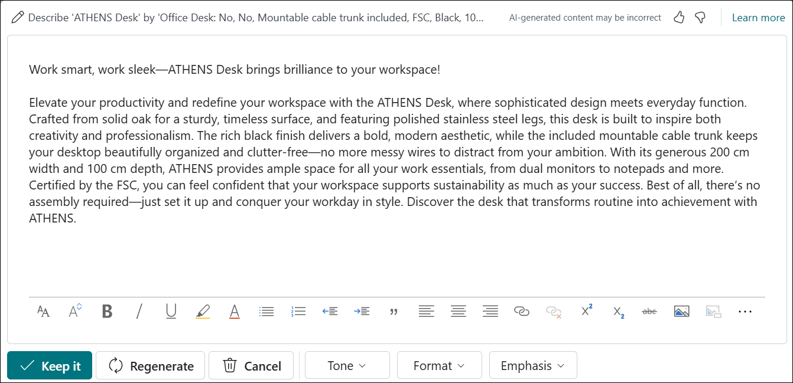

    ```
    Important: AI-generated content is a suggestion only. It may contain inaccuracies or language that does not fully align with your organization’s standards. Always review and edit the content before saving or publishing.
    ```

## Exercise 2: Review, Edit, and Save Marketing Text

In this exercise, you will refine the AI-generated marketing text. You will edit and format the content, generate alternative suggestions , customize tone and structure, and perform a final validation before saving.

1. In the Copilot editor window, place the cursor inside the text box.

1. Make direct edits to improve:

   - Clarity
   - Accuracy
   - Brand alignment

1. Use the formatting toolbar at the bottom of the editor to:

   - Apply text styling
   - Structure content for readability
   - Insert hyperlinks if needed

   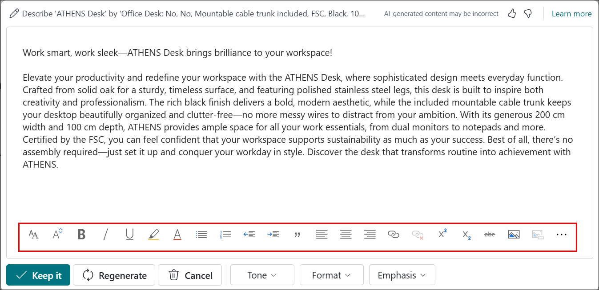

1. Select **Regenerate** to create a new suggestion.

   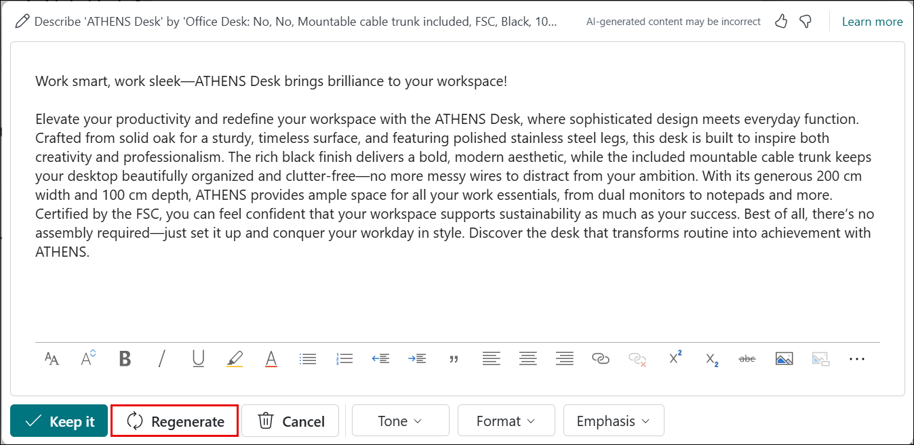

1. Use the **navigation controls** at the top of the page (e.g., *1 of 2*) to move between available suggestions.

   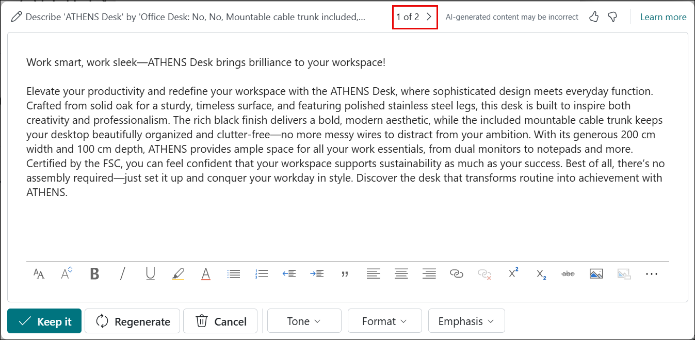

1. Compare variations and determine which draft best aligns with your requirements.

1. Choose a **tone (1)** that aligns with your brand voice, such as:

   - **Formal** – For professional and corporate communication.
   - **Creative** – For engaging and conversational messaging.

   For this select **Formal (2)** and click **Regenerate (3)**

   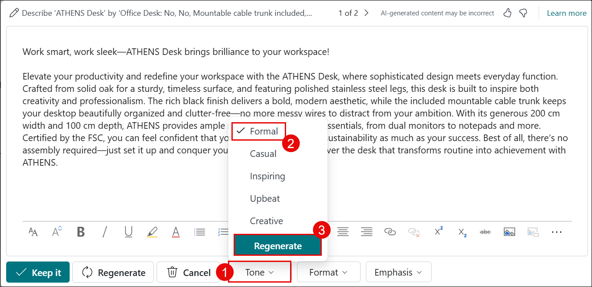

1. Select the **format (1)** of the marketing text:

   - **Tagline** – A short, catchy phrase.
   - **Paragraph** – A detailed descriptive block of text.
   - **Tagline + Paragraph** – A combination of both.
   - **Brief** – An introductory statement followed by bullet points.

   For this select **Paragraph (2)** and click **Regenerate (3)**

   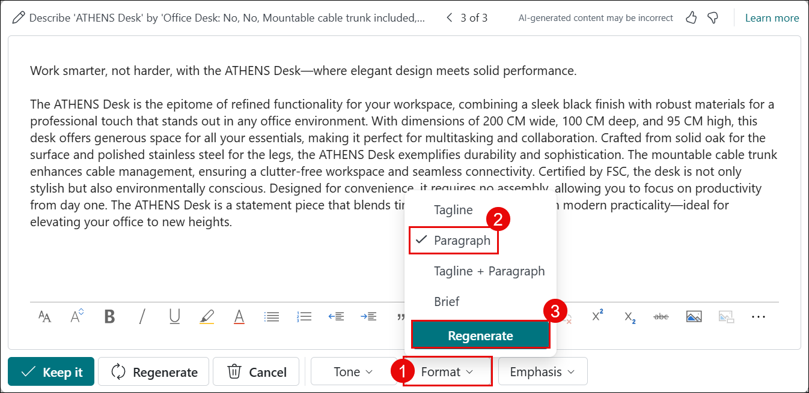

1. Select predefined qualities to emphasize, such as:

   - Innovation
   - Power
   - Reliablity
   - Elegance

   For this select **Sustainability (2)** and click **Regenerate (3)**
   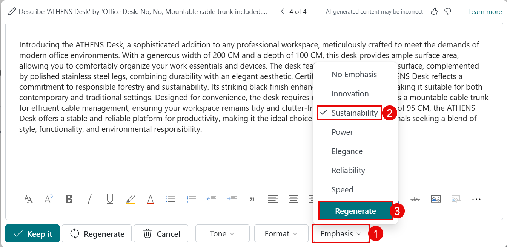

1. Choose attributes that logically align with the item type. After adjusting preferences, select **Regenerate** to apply the new settings.

   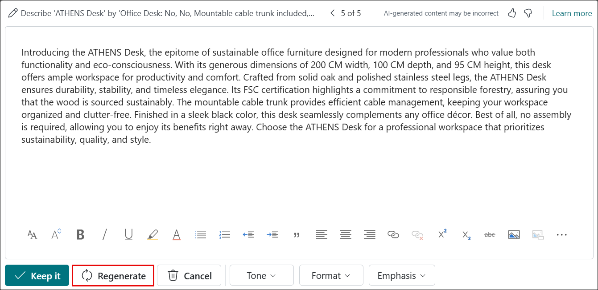

1. Conduct a thorough review of the text. Confirm that:

   - Product details are accurate
   - Content complies with company standards
   - The tone aligns with brand guidelines

1. If satisfied, select **Keep it** to save the marketing text.

   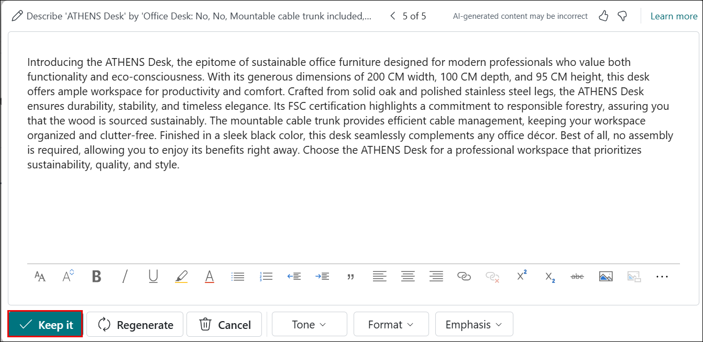

1. Click OK to confirm the update.

   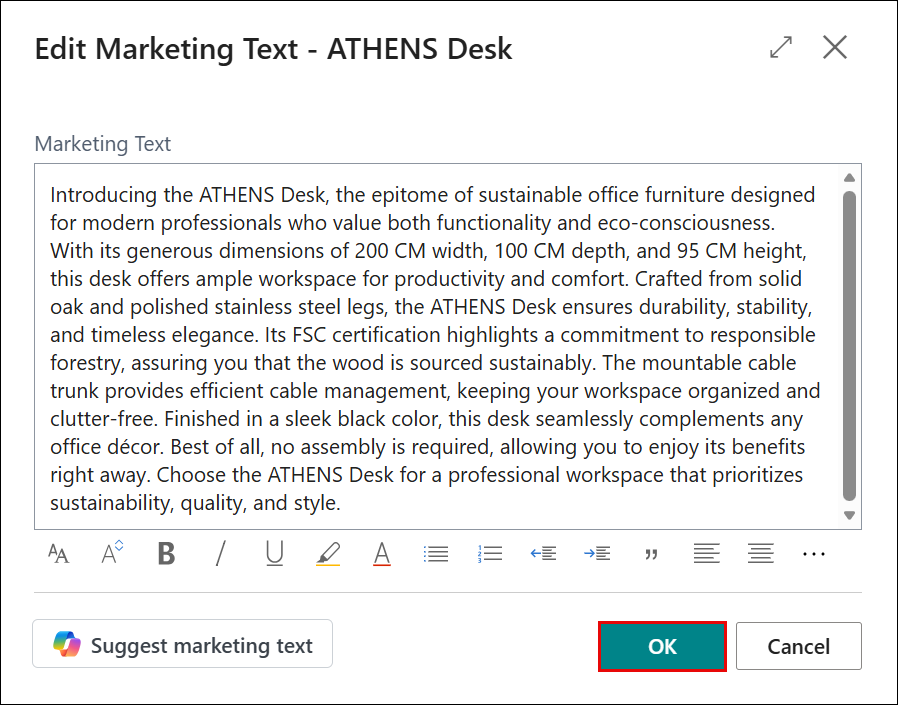

## Conclusion

In this lab, you explored how to use Copilot in Microsoft Dynamics 365 Business Central to efficiently create and refine marketing text for an
existing item. You learned how to generate an initial AI-powered draft, enhance content quality by selecting relevant item attributes, and customize tone, structure, and emphasis to align with brand guidelines.

You also reviewed multiple suggestions, edited the content for clarity and accuracy, and finalized the text before saving it. Overall, this lab demonstrated how AI can accelerate content creation while reinforcing the importance of human review to ensure accuracy, consistency, and compliance with organizational standards.
